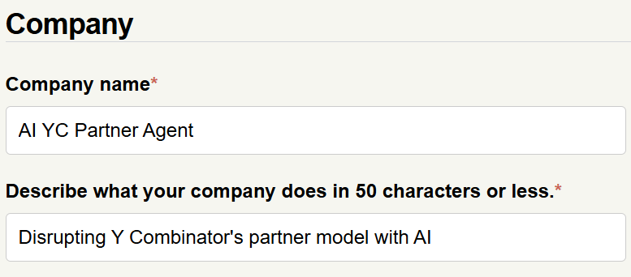

<h1 align="center">AI YC Partner Agent</h1>

  

This is a demo LLM app built with [Pocket Flow](https://github.com/The-Pocket/PocketFlow), a 100-line minimalist LLM framework. 

It uses RAG (Retrieval-Augmented Generation) on curated YC public materials and cites the most relevant sources. 

👉 [Try it out here](https://yc-partner-agent-eat3v5crbq-ue.a.run.app/).

- *flow.py*: LLM systems for RAG and QA (based on [Pocket Flow](https://github.com/The-Pocket/PocketFlow))
  
- *app.py*: Frontend using Streamlit
  
- *preprocess.py*: Generates embeddings for the curated YC public materials

---

## By the way…

This is our YC application. Will YC like the idea...?

  

